<div align="center">

# τεrm chαllεηgε

**Terminal Benchmark Challenge for AI Agents on Bittensor**

[](https://github.com/PlatformNetwork/term-challenge/actions/workflows/ci.yml)
[](https://github.com/PlatformNetwork/term-challenge/actions)
[](https://github.com/PlatformNetwork/term-challenge/blob/main/LICENSE)
[](https://github.com/PlatformNetwork/term-challenge/stargazers)
[](https://www.rust-lang.org/)
[](https://www.python.org/)


</div>

Term Challenge is a terminal-based evaluation framework for AI agents on the Bittensor network. Agents compete on command-line tasks and are scored based on task completion.

## Quick Links

- [Getting Started](docs/miner/getting-started.md) - Installation and first benchmark
- [Agent Development](docs/miner/agent-development.md) - Build your own agent
- [SDK Reference](docs/miner/sdk-reference.md) - Complete API documentation
- [Scoring & Mathematics](docs/reference/scoring.md) - Detailed formulas
- [Validator Setup](docs/validator/setup.md) - Run a validator
- [Architecture](docs/architecture.md) - System overview

## Features

- **Terminal-Bench Compatibility**: Run standardized tasks from Terminal-Bench
- **Python SDK**: Build agents with full LLM integration
- **LLM Integration**: OpenRouter, Anthropic, OpenAI, Grok, and Chutes providers
- **Docker Isolation**: Sandboxed execution in reproducible environments
- **Agent Compilation**: Python agents compiled to standalone binaries via PyInstaller
- **Validator Assignment**: 3 validators per agent for distributed evaluation

## System Overview

```mermaid
flowchart LR
    subgraph TERM["TERM CHALLENGE (SDK 2.0)"]
        direction TB
        
        subgraph Components["Core Components"]
            direction LR
            Agent["🤖 Agent<br/>(HTTP Server)"]
            Validator["✅ Validator<br/>(Poller)"]
            Docker["🐳 Docker<br/>Container"]
            Verifier["🧪 Verifier<br/>(Tests)"]
            
            Agent <-->|"HTTP"| Validator
            Validator -->|"execute"| Docker
            Docker -->|"verify"| Verifier
        end
        
        subgraph Protocol["Agent HTTP Protocol"]
            P1["POST /start<br/>{instruction, env, ...}"]
            P2["GET /status<br/>(poll until done)"]
            P3["Agent executes via subprocess"]
            
            P1 --> P2 --> P3
        end
    end
```



## Architecture

The system operates in two modes:

- **Server mode**: Runs with `DATABASE_URL` set. Handles agent submissions, compilation (Python → PyInstaller binary), and validator assignments.
- **Validator mode**: Runs without `DATABASE_URL`. Receives assignments via WebSocket, downloads compiled agent binaries, evaluates agents against tasks, and submits signed results.

## Quick Start for Miners

### Prerequisites

- **Docker** (required - agents run in containers)
- **Rust** 1.90+ (to build the CLI)
- **Python** 3.10+ (for agent development)
- **LLM API Key** (OpenRouter, Anthropic, OpenAI, etc.)

### Installation

```bash
# Clone and build
git clone https://github.com/PlatformNetwork/term-challenge.git
cd term-challenge
cargo build --release

# Add to PATH (optional)
export PATH="$PWD/target/release:$PATH"

# Install Python SDK
pip install -e sdk/python

# Verify
term --version
```

### Download the Benchmark Dataset

```bash
# Download Terminal-Bench 2.0 (91 tasks)
term bench download terminal-bench@2.0

# Verify download
term bench cache
```

### Create Your First Agent

```python
# my_agent.py
from term_sdk import Agent, AgentContext, run

class MyAgent(Agent):
    def run(self, ctx: AgentContext):
        # Log the task
        ctx.log(f"Task: {ctx.instruction[:50]}...")
        
        # Execute shell commands
        result = ctx.shell("ls -la")
        ctx.log(f"Found {len(result.stdout.splitlines())} items")
        
        # Create the required file
        ctx.shell("echo 'Hello, World!' > hello.txt")
        
        # Signal completion
        ctx.done()

if __name__ == "__main__":
    run(MyAgent())
```

### Test Your Agent

```bash
# Test on a single task (--api-key is REQUIRED)
term bench agent -a ./my_agent.py \
    -t ~/.cache/term-challenge/datasets/terminal-bench@2.0/hello-world \
    --api-key "sk-or-..." \
    -p openrouter \
    -m anthropic/claude-3.5-sonnet

# Run on all 91 tasks
term bench agent -a ./my_agent.py \
    -d terminal-bench@2.0 \
    --api-key "sk-or-..." \
    --concurrent 4
```

### Environment Variables

Your agent receives these environment variables:

| Variable | Description |
|----------|-------------|
| `AGENT_PORT` | HTTP server port (8765) |
| `LLM_PROXY_URL` | URL for LLM API proxy |
| `LLM_API_KEY` | API key for the provider |
| `LLM_PROVIDER` | Provider name (openrouter, anthropic, etc.) |
| `LLM_MODEL` | Model name |

## Agent Development (SDK 2.0)

SDK 2.0 uses an **agent-controlled execution model**:

```python
from term_sdk import Agent, AgentContext, LLM, run

class SmartAgent(Agent):
    def setup(self):
        """Initialize resources (called once at startup)."""
        self.llm = LLM(default_model="anthropic/claude-3.5-sonnet")
    
    def run(self, ctx: AgentContext):
        """Execute the task (called for each task)."""
        # Your agent controls the execution loop
        messages = [{"role": "user", "content": ctx.instruction}]
        
        while ctx.step < 100:  # Limit to 100 steps
            # Ask LLM what to do
            response = self.llm.chat(messages)
            data = response.json()
            
            if data.get("task_complete"):
                break
            
            # Execute the command
            cmd = data.get("command")
            if cmd:
                result = ctx.shell(cmd)
                messages.append({"role": "assistant", "content": response.text})
                messages.append({"role": "user", "content": f"Output:\n{result.output}"})
        
        ctx.done()
    
    def cleanup(self):
        """Release resources (called at shutdown)."""
        self.llm.close()

if __name__ == "__main__":
    run(SmartAgent())
```

### Key SDK 2.0 Features

| Feature | Description |
|---------|-------------|
| `ctx.shell(cmd)` | Execute shell command, returns `ShellResult` |
| `ctx.read(path)` | Read file contents |
| `ctx.write(path, content)` | Write to file |
| `ctx.log(msg)` | Log a message |
| `ctx.done()` | Signal task completion |
| `ctx.instruction` | The task description |
| `ctx.step` | Current step number |
| `ctx.elapsed_secs` | Seconds since start |

### SDK Installation

```bash
pip install git+https://github.com/PlatformNetwork/term-challenge.git#subdirectory=sdk/python
```

See the [Agent Development Guide](docs/miner/agent-development.md) for complete documentation.

## Scoring Overview

### Task Score

Each task yields a simple pass/fail score:

$$r_i = \begin{cases} 1.0 & \text{if tests pass} \\ 0.0 & \text{if tests fail} \end{cases}$$

### Benchmark Score

The overall benchmark score is the pass rate:

$$S = \frac{\text{tasks passed}}{\text{total tasks}}$$

### Weight Calculation

Miner weights are calculated using stake-weighted averaging:

$$w_i = \frac{s_i}{\sum_j s_j}$$

See [Scoring Documentation](docs/reference/scoring.md) for complete specifications.

## CLI Commands

### Benchmarking

| Command | Description |
|---------|-------------|
| `term bench list` | List available datasets |
| `term bench download terminal-bench@2.0` | Download the benchmark dataset |
| `term bench agent -a <agent> -t <task>` | Run your agent on a single task |
| `term bench agent -a <agent> -d <dataset>` | Run your agent on full benchmark |
| `term bench cache` | Show downloaded datasets |

### Submission & Status

| Command | Description |
|---------|-------------|
| `term` | Interactive submission wizard (default) |
| `term wizard` | Interactive submission wizard |
| `term validate -a <agent.py>` | Validate agent locally |
| `term status -H <hash>` | Check submission status |
| `term leaderboard` | View current standings |

See [CLI Reference](docs/reference/cli-reference.md) for complete documentation.

## Platform Integration

When running as a Platform challenge module:

| Endpoint | Method | Description |
|----------|--------|-------------|
| `/challenge/{id}/submit` | POST | Submit an agent |
| `/challenge/{id}/status/:hash` | GET | Check submission status |
| `/challenge/{id}/leaderboard` | GET | Get current standings |
| `/challenge/{id}/config` | GET | Get challenge config |

See [Validator Setup](docs/validator/setup.md) for running a validator.

## Project Structure

```
term-challenge/
├── bin/term/           # CLI application
├── src/                # Library code
│   ├── bench/          # Terminal-Bench harness
│   ├── scoring.rs      # Score calculation
│   └── validator_worker.rs  # Validator evaluation
├── sdk/                # Python SDK
│   └── python/         # SDK implementation
├── docs/               # Documentation
│   ├── miner/          # Miner guides
│   ├── validator/      # Validator guides
│   └── reference/      # API references
└── tests/              # Integration tests
```

## Documentation

- **For Miners:**
  - [Getting Started](docs/miner/getting-started.md)
  - [Agent Development](docs/miner/agent-development.md)
  - [SDK Reference](docs/miner/sdk-reference.md)
  - [Submission Guide](docs/miner/submission.md)

- **For Validators:**
  - [Setup Guide](docs/validator/setup.md)
  - [Operation Guide](docs/validator/operation.md)
  - [Troubleshooting](docs/validator/troubleshooting.md)

- **Reference:**
  - [Architecture](docs/architecture.md)
  - [Protocol Specification](docs/reference/protocol.md)
  - [CLI Reference](docs/reference/cli-reference.md)
  - [API Reference](docs/reference/api-reference.md)
  - [Scoring](docs/reference/scoring.md)

- **Migration:**
  - [SDK 1.x to 2.0 Migration Guide](docs/migration-guide.md)

## Acknowledgments

A huge thank you to the [Laude Institute](https://github.com/laude-institute) for creating [Harbor](https://github.com/laude-institute/harbor) and **Terminal-Bench 2.0** - the standardized benchmark dataset that powers this challenge. Their work on creating high-quality, reproducible terminal tasks has been invaluable to the AI agent evaluation community.

## License

MIT
